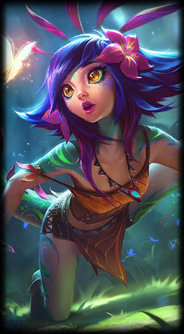
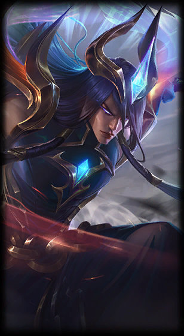
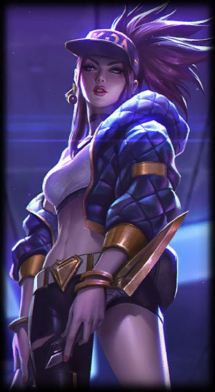

### Hi there 👋

## I'm Rithika.

Shhh, I'm working on my profile.

### LoL Stats
<!---LOL-STATS-START-HERE--->
<h3 align='center'> Data from Last 10 Matches for R1tzcrackers</h3><table align='center'><tr></tr>
<tr align='left'><th><pre>Top 5 Recently Played Champions
-------------------------
 Akali            |███████████--------------|  40.00%
 Taliyah          |██████-------------------|  20.00%
 Neeko            |███----------------------|  10.00%
 Katarina         |███----------------------|  10.00%
 Quinn            |███----------------------|  10.00%
-------------------------
Seconds CCing Enemies: 121
Total Abilities Used: 1856
Total Solokills: 19
Total Takedowns: 91
</pre></th><th><pre>Top 3 Champion Masteries
------------------------
 Neeko: 136368 
 Yone: 108926 
 Akali: 90335 
</pre></th></tr></table>
<h6 align='center'>

[README Profile LoL Stats](https://github.com/marketplace/actions/readme-profile-lol-stats) by [rithikasiilva](https://github.com/rithikasilva)
</h6>
<!---LOL-STATS-END-HERE--->

  
  
  
  
  
#### Blog Posts
<!-- BLOG-POST-LIST:START -->
- [Initial Alpha of README LoL Stats](https://rithikasilva.github.io/rs-blog/2022/12/24/READMELOLSTATS/)
- [iSH V.S. Termius V.S. Blink Shell for SSH](https://rithikasilva.github.io/rs-blog/2022/06/17/BlinkiSHTermius/)
- [Agorithmic Art Bot](https://rithikasilva.github.io/rs-blog/2021/12/31/AlgorithmicArtBot/)
<!-- BLOG-POST-LIST:END -->

<!--
## My Stats

  
 -->
  
<!--
  

-->

<!--
**rithikasilva/rithikasilva** is a ✨ _special_ ✨ repository because its `README.md` (this file) appears on your GitHub profile.

Here are some ideas to get you started:

- 🔭 I’m currently working on ...
- 🌱 I’m currently learning ...
- 👯 I’m looking to collaborate on ...
- 🤔 I’m looking for help with ...
- 💬 Ask me about ...
- 📫 How to reach me: ...
- 😄 Pronouns: ...
- ⚡ Fun fact: ...
-->
